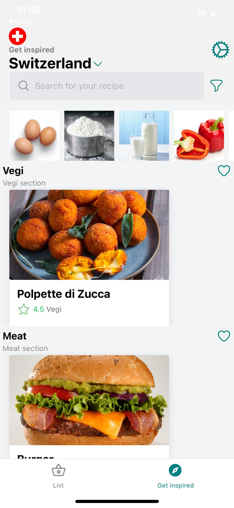
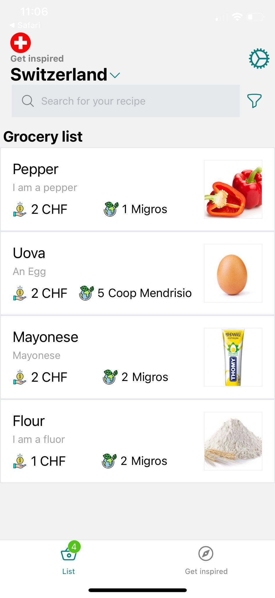
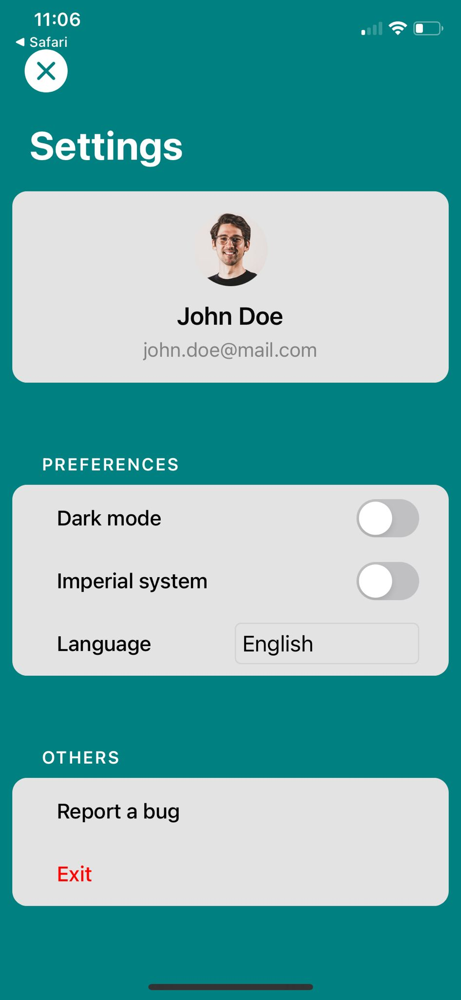
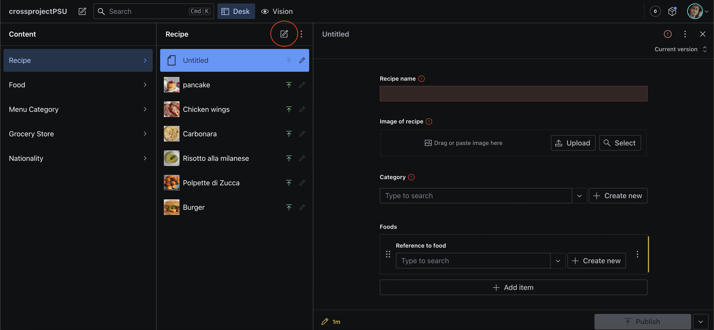
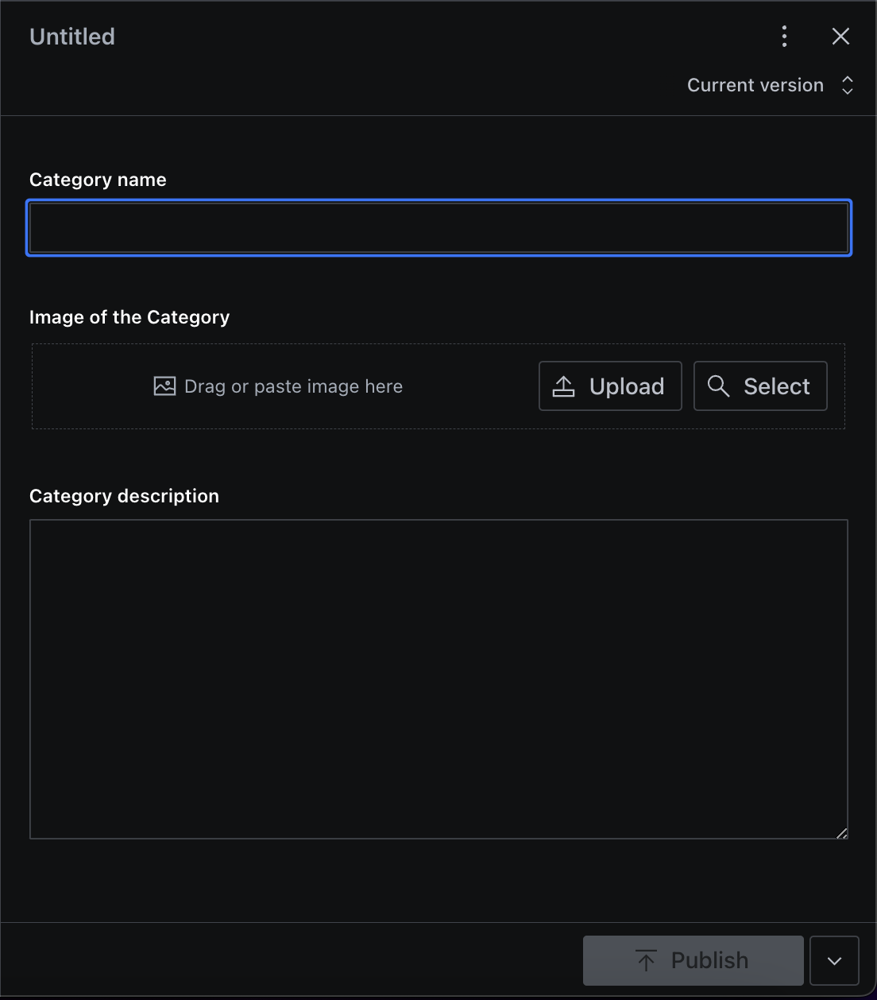
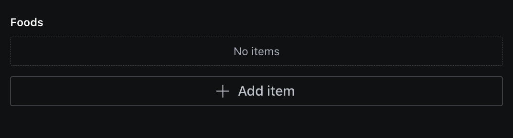
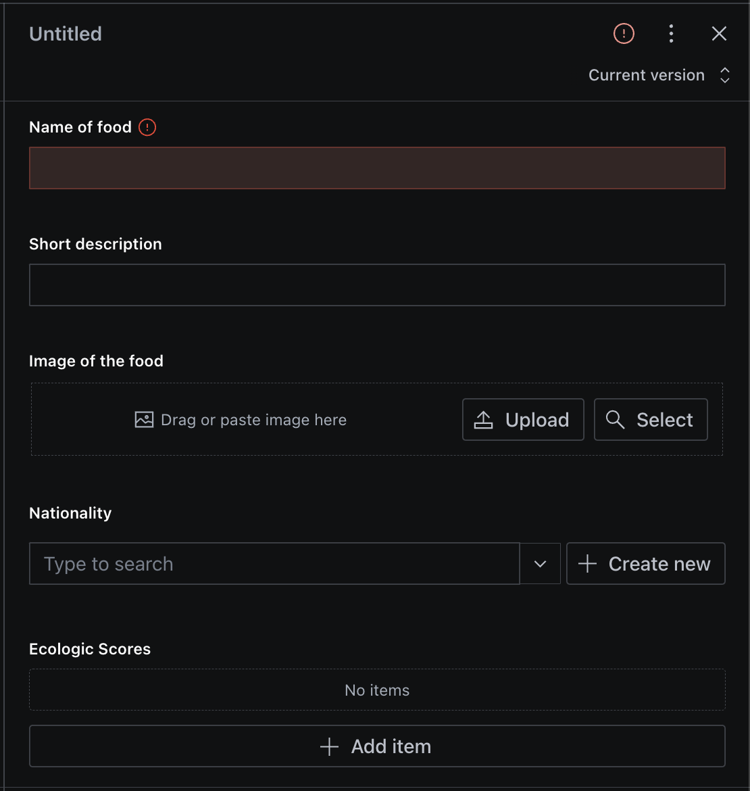
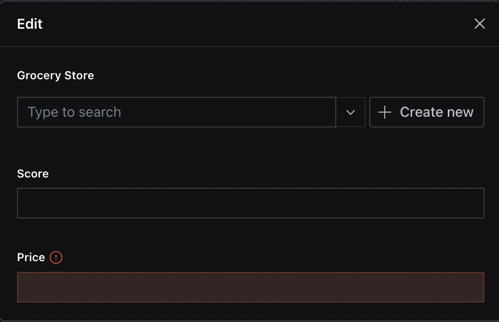

FoodPrint is a mobile application built with React-Native that allows users to search for recipes by category and country of origin, generate a shopping list by simply clicking on a recipe, and locate grocery stores that offer the necessary ingredients based on the lowest price or eco-friendliness score.

For more information about the requirements for this project, please see the [requirements document](https://github.com/slashdotted/C4110Z.1-2023-Team-3/wiki/Requirement).

## Getting Started

### Prerequisites

- Node.js and npm (or yarn) installed on your computer.

### Installing and run the app

1. Clone this repository to your local machine.
2. Navigate inside the the following path: C4110Z.1-2023-Team-3/crossproject/app
2. Run `npm install` and `yarn` to install dependencies.
3. Run `npm start` or `yarn start` to start the development server.
4. Download Expo-Go on your phone.
4. Scan the QR code generate from the step 3.

### Insert data in the sanity database

1. Go to the sanity folder 
2. Run `npm install` and `yarn` to install sanity client.
3. Run `sanity start` 
4. The programm will open on localhost the CMS server.

## Pages

### GetInspired page

### GroceryList

### Settings

## Sanity CMS

### Add new Recipe

### Add new Category

### Add new Food

#### Add the grocery data for the food

## Contributors

* **Gionata Donati**
* **Matteo Arena**
* **Kinsley Wargo**
* **Jake Sterling**
* **Sammi Zanine**

## Credits

The Recipe Search App was created by Team 3 of the C4110Z.1-2023 course at SUPSI

